# 🖐️ Hand Gesture Recognition for American Sign Language (ASL) 🖐️

# Overview

This project is a Hand Gesture Recognition System that utilizes Computer Vision and Deep Learning to classify American Sign Language (ASL) letters from A to Z in real-time. The system uses OpenCV for image processing, cvzone for hand tracking and classification, and a pre-trained deep learning model for prediction.

# Requirements

Ensure you have the following dependencies installed:

1. Python 3.10 <br>
2. OpenCV (cv2) <br>
3. NumPy (numpy any version) <br>
4. TensorFlow 2.12.1 <br>
5. cvzone (any version) <br>
6. math <br>
7. time <br>

You can install the dependencies using:


```bash
pip install opencv-python numpy tensorflow==2.12.1 cvzone
```

# What I Do!

1️⃣ Hand Detection

The first step in the pipeline is detecting my hand within a video frame.<br>
✅ I used OpenCV and a hand tracking module to locate the position of my hand.<br>
✅ The model identifies the bounding box around my hand in real time.<br>
✅ This step is crucial because detecting the hand accurately ensures better recognition results later.

<p align="center">
    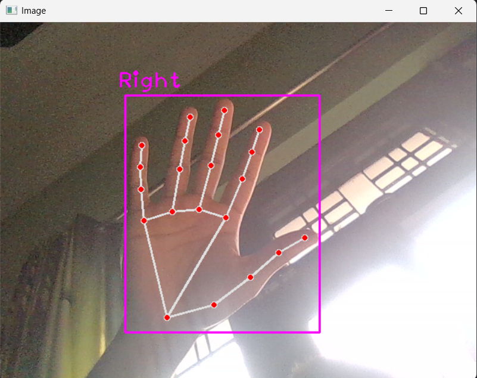
</p>

  
2️⃣ Image Cropping ✂️

Once the hand is detected, I needed to crop the image to focus only on my hand and remove unnecessary background.<br>
🔹 This step isolates the hand from the rest of the scene, improving clarity for the recognition model.<br>
🔹 However, the initial cropping sometimes removed important parts of my hand due to variations in positioning and movement.<br>

<p align="center">
    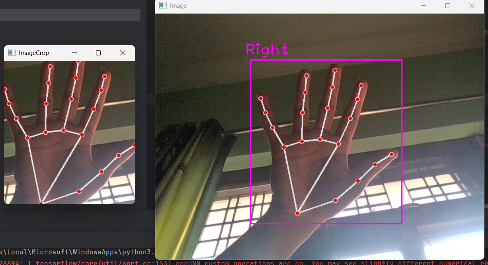
</p>

3️⃣ Expanding the Cropped Image 🔍

To address the issue of excessive cropping, I expanded the image by adding extra space around the detected hand.<br>
🛠️ This ensured that my entire hand was within the frame.<br>
🛠️ It helped improve the consistency of images passed to the model.

<p align="center">
    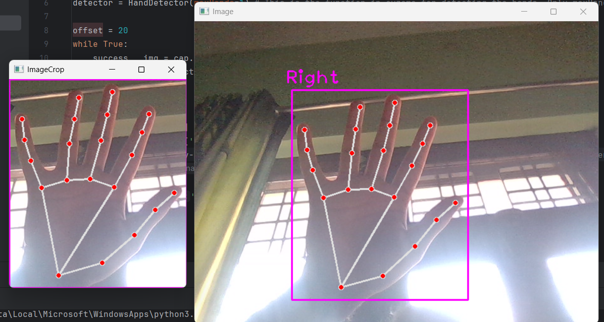&nbsp;&nbsp;&nbsp;&nbsp;&nbsp;&nbsp;
    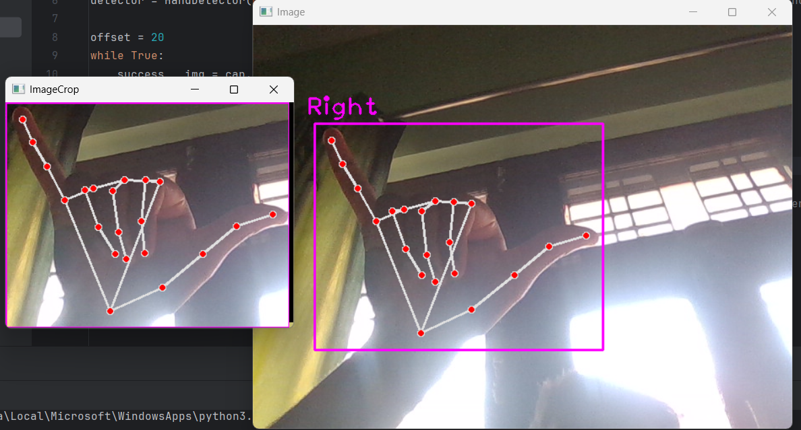
</p>

4️⃣ Using a White Image as a Base ⚪

One challenge in hand gesture recognition is that different hand images have different dimensions.<br>
📏 If images are fed into a deep learning model with varying sizes, it can affect prediction accuracy.<br>
📏 To solve this, I introduced a white background image (a blank canvas) onto which I placed my cropped hand image.<br>
📏 This created a uniform dataset where all images had the same base size.

<p align="center">
    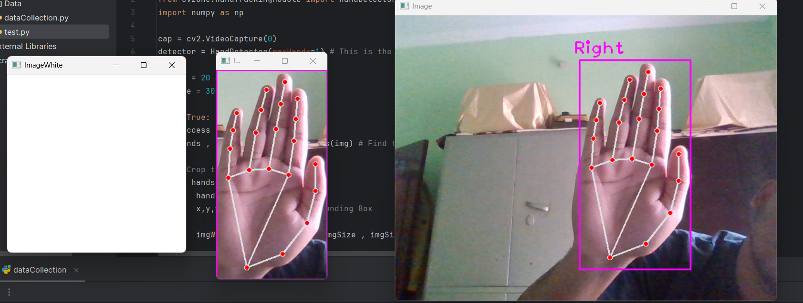
</p>

5️⃣ Overlaying the Cropped Image on the White Background 🏗️

Once the cropped image of my hand was ready, I overlaid it onto the white background.<br>
🎯 This process ensured that each input image had the same dimensions, making it easier for the deep learning model to process.<br>
🎯 It also helped in handling variations in hand positioning by keeping all images centered.

<p align="center">
    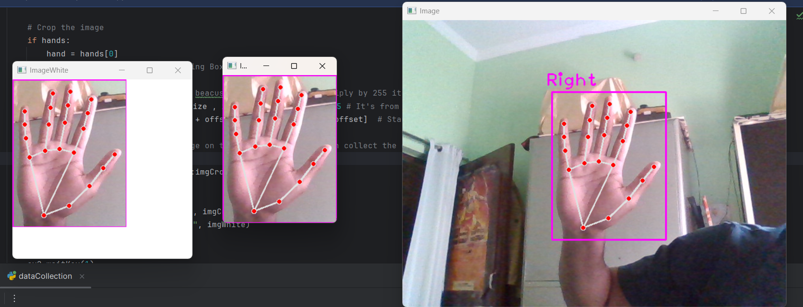&nbsp;&nbsp;&nbsp;&nbsp;&nbsp;&nbsp;
    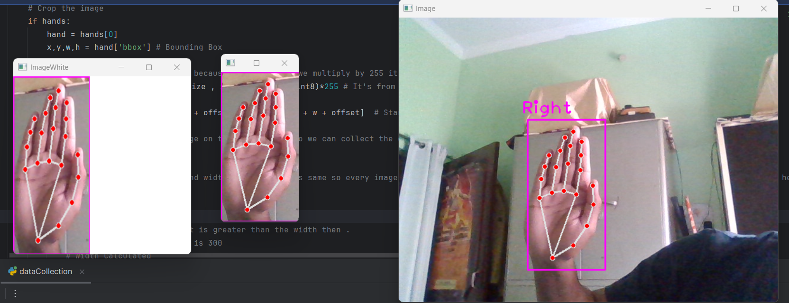
</p>

6️⃣ Centering & Standardizing Image Size 📐

To further standardize the images, I ensured that they were centered on the white background and resized them to 300 × 300 pixels.

🔢 Initially, I used a simple logic:

If the height was greater than the width, I set the height to 300 pixels and adjusted the width proportionally.<br>
If the width was greater than the height, I set the width to 300 pixels and adjusted the height proportionally.<br>
🔢 This made sure that all input images were square-shaped and of consistent size before being passed to the model.<br>

<p align="center">
    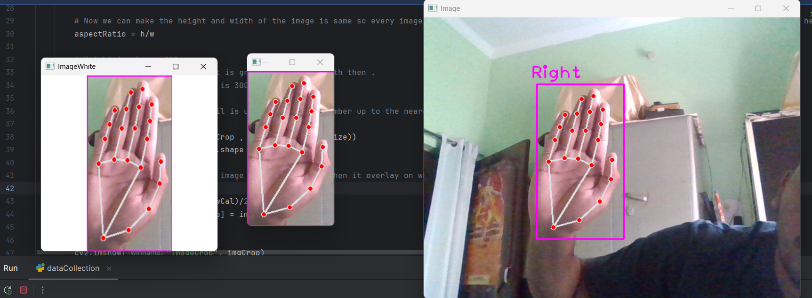&nbsp;&nbsp;&nbsp;&nbsp;&nbsp;&nbsp;
    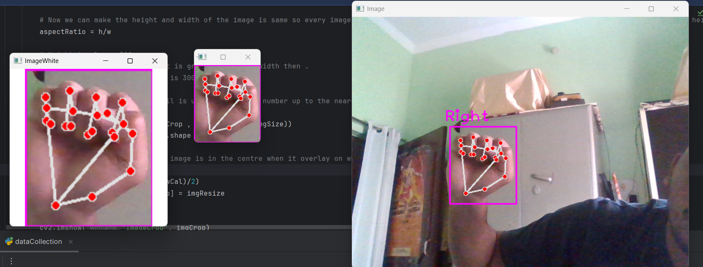&nbsp;&nbsp;&nbsp;&nbsp;&nbsp;&nbsp;
    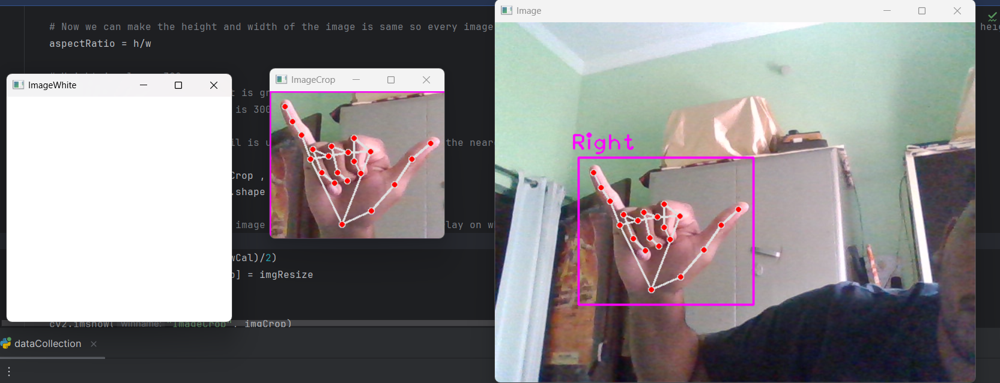
</p>

7️⃣ Model Training & Prediction 🤖
After preparing the dataset, I trained a deep learning model to recognize hand gestures.
📌 At first, I built a basic model that could detect only three letters: A, B, and C.
📌 Once I confirmed that the model was working correctly, I expanded it to recognize all 26 letters (A-Z) of ASL.
📌 The final model was capable of real-time recognition, predicting hand signs with high accuracy.

<p align="center">
    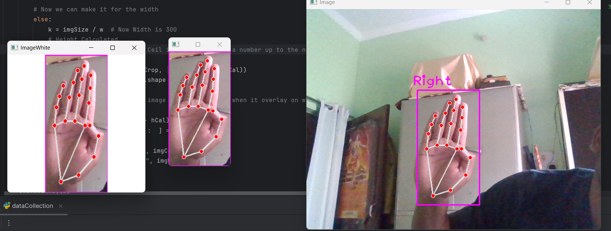&nbsp;&nbsp;&nbsp;&nbsp;&nbsp;&nbsp;
    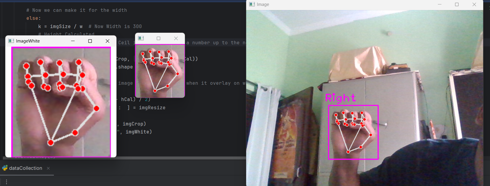&nbsp;&nbsp;&nbsp;&nbsp;&nbsp;&nbsp;
    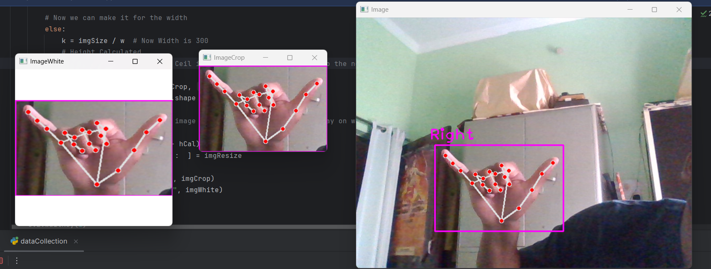
</p>

# How it work!

# 1. Import Necessary Modules

 ```bash

import cv2
from cvzone.HandTrackingModule import HandDetector
from cvzone.ClassificationModule import Classifier
import numpy as np
import math
import time

```

1. cv2: Used for capturing video and processing images. <br>
2. HandDetector: Detects hand gestures using OpenCV and mediapipe.<br>
3. Classifier: Loads a pre-trained deep learning model for gesture classification.<br>
4. numpy: Helps with image processing and array manipulations.<br>
5. math: Used for mathematical operations like rounding.<br>
6. time: Used for adding delays (if needed).<br>

# 2. Initialize Video Capture & Models

```bash
cap = cv2.VideoCapture(0)
detector = HandDetector(maxHands=1)  # Detect a single hand
classifier = Classifier("Model/keras_model.h5", "Model/labels.txt")
```

1. cv2.VideoCapture(0): Accesses the webcam for real-time input.<br>
2. HandDetector(maxHands=1): Detects up to one hand at a time.<br>
3. Classifier: Loads the trained deep learning model and labels.<br>

# 3. Define Parameters

```bash
offset = 20  # Border around the detected hand
imgSize = 300  # Resized image size for classification
folder = "Data/C"  # Directory to store captured images
counter = 0  # Counter for saving images
labels = ["A", "B", "C"]  # Labels for classification
```

1. offset: Adds padding to the cropped hand image.<br>
2. imgSize: Standardizes image dimensions for classification.<br>
3. folder: Directory to store data (if needed for dataset collection).<br>
4. counter: Tracks the number of images saved.<br>
5. labels: List of letters the model can classify.

# 4. Capture Video & Process Frames

```bash
while True:
    success, img = cap.read()
    imgOutput = img.copy()
    hands, img = detector.findHands(img)  # Detect hands
```
1. Reads frames from the webcam.<br>
2. Copies the frame to imgOutput for visualization.<br>
3. Detects hands using findHands().

# 5. Process Detected Hands

```bash
if hands:
    hand = hands[0]
    x, y, w, h = hand['bbox']  # Extract bounding box coordinates
    imgWhite = np.ones((imgSize, imgSize, 3), np.uint8) * 255  # Create a white canvas
    imgCrop = img[y - offset:y + h + offset, x - offset:x + w + offset]  # Crop hand
```

1. Extracts hand bounding box (x, y, width, height).<br>
2. Creates a white background (imgWhite).<br>
3. Crops the hand region from the original frame.

# 6. Resize Image to Maintain Aspect Ratio

```bash
aspectRatio = h / w  # Determine aspect ratio
if aspectRatio > 1:
    k = imgSize / h
    wCal = math.ceil(k * w)
    imgResize = cv2.resize(imgCrop, (wCal, imgSize))
    wGap = math.ceil((imgSize - wCal) / 2)
    imgWhite[:, wGap:wCal + wGap] = imgResize
else:
    k = imgSize / w
    hCal = math.ceil(k * h)
    imgResize = cv2.resize(imgCrop, (imgSize, hCal))
    hGap = math.ceil((imgSize - hCal) / 2)
    imgWhite[hGap:hCal + hGap, :] = imgResize
```

1. Maintains the aspect ratio while resizing the cropped hand image.<br>
2. Centers the resized image onto the white background (imgWhite).

# 7. Predict Hand Gesture

```bash
prediction, index = classifier.getPrediction(imgWhite, draw=False)
```
1. Passes the processed image to the classifier.<br>
2. Returns the predicted label and its index.

# 8. Display Results

```bash
cv2.rectangle(imgOutput, (x - offset, y - offset - 50), (x - offset + 100, y - offset - 50 + 50), (255, 0, 255), cv2.FILLED)
cv2.putText(imgOutput, labels[index], (x, y - 26), cv2.FONT_HERSHEY_PLAIN, 1.7, (255, 255, 255), 2)
cv2.rectangle(imgOutput, (x - offset, y - offset), (x + w + offset, y + h + offset), (255, 0, 255), 4)
cv2.imshow("ImageCrop", imgCrop)
cv2.imshow("ImageWhite", imgWhite)
```
1. Draws a bounding box around the detected hand.<br>
2. Displays the predicted letter near the hand.<br>
3. Shows the cropped and preprocessed images.

# 9. Show Final Output & Wait for Key Press

```bash
cv2.imshow("Image", imgOutput)
cv2.waitKey(1)
```

1. Displays the final output with bounding boxes and predictions.<br>
2. Continues processing until a key is pressed.

# How to Run

1. Clone the repository and navigate to the project directory.

2. Install dependencies:

```pip install opencv-python numpy tensorflow==2.12.1 cvzone```

3. Run the script:

```python hand_gesture_recognition.py```

4. Use your webcam to make ASL gestures and see real-time predictions!


